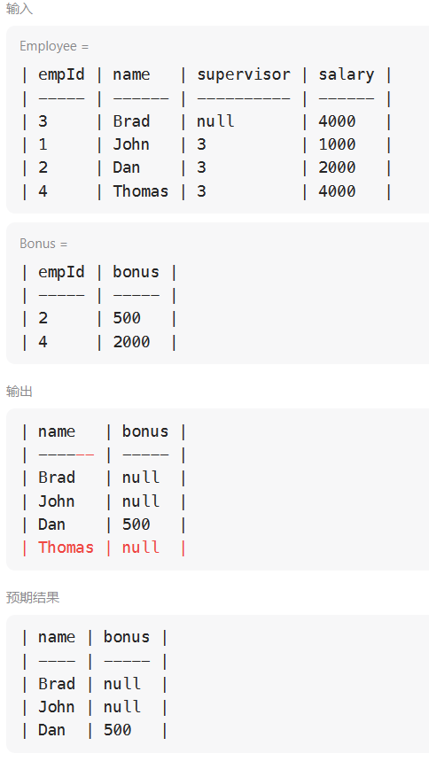

## 查询

### [1378. 使用唯一标识码替换员工ID](https://leetcode.cn/problems/replace-employee-id-with-the-unique-identifier/)

```mysql
select unique_id, name from 
EmployeeUNI right join Employees
on EmployeeUNI.id = Employees.id;
```

### [1068. 产品销售分析 I](https://leetcode.cn/problems/product-sales-analysis-i/)

```mysql
select p.product_name, s.year, s.price from Sales s inner join  Product p
on s.product_id = p.product_id;
```

### [1581. 进店却未进行过交易的顾客](https://leetcode.cn/problems/customer-who-visited-but-did-not-make-any-transactions/)

左连接，然后找出null就行了，连接出来的null正是我们需要的，再按customer_id聚合

```mysql
SELECT customer_id, count(customer_id) count_no_trans
FROM Visits v
LEFT JOIN transactions t 
ON v.visit_id = t.visit_id
WHERE transaction_id IS NULL
GROUP BY customer_id;
```

### [197. 上升的温度](https://leetcode.cn/problems/rising-temperature/)

如何比较日期数据？

1. 使用交叉联结会将两个表中所有的数据两两组合
2. datediff(日期1, 日期2)：
   得到的结果是日期1与日期2相差的天数。
   如果日期1比日期2大，结果为正；如果日期1比日期2小，结果为负。
3. 另一个关于时间计算的函数是：
   timestampdiff(时间类型, 日期1, 日期2)
   这个函数和上面diffdate的正、负号规则刚好相反。
   日期1大于日期2，结果为负，日期1小于日期2，结果为正。

```mysql
SELECT w1.id FROM Weather w1, Weather w2
WHERE TIMESTAMPDIFF(day, w1.recordDate, w2.recordDate) = -1
AND w1.Temperature > w2.Temperature
```

### [1661. 每台机器的进程平均运行时间](https://leetcode.cn/problems/average-time-of-process-per-machine/)

CASE WHEN巧妙按activity_type 判 timestamp 的正负

SUM求和，当进程为end时加上该时间戳，start时减去该时间戳

```mysql
SELECT machine_id, 
ROUND(SUM(timestamp * (CASE WHEN activity_type = 'end' THEN 1 else -1 END)) / COUNT(DISTINCT process_id), 3) processing_time
FROM Activity
GROUP BY machine_id
```

### [577. 员工奖金](https://leetcode.cn/problems/employee-bonus/)

join之中的on和where的区别：

- on是进行连接的条件，如果用on，那么会得到如下错误结果，原因就在于，**on是连接条件，不是查询条件**



- 进行left join时，满足连接条件的会去向左匹配（根据E.empId = B.empId)，此时查出来的表中Thomas的bonus还是2000，**当你拓展连接条件为：B.bonus < 1000时，此时左表中的字段不会动，右表中的会向左表进行匹配，匹配不到则会为null，此时就出现了下列情况**。
- 因此我们应该在id匹配的情况下，利用where来进行表的条件查询，而不能用on

```mysql
select name, bonus from Employee e left outer join Bonus b
on e.empId = b.empId
where bonus is null or bonus < 1000
```

### [1280. 学生们参加各科测试的次数](https://leetcode.cn/problems/students-and-examinations/)

1.查询每个学生参加每一门科目测试的次数
2.结果按 student_id 和 subject_name 排序(ORDER BY s.student_id,su.subject_name)

首先Students和Subjects所有数据是取笛卡尔积(在第一点的基础上拼接`Examinations`中的每个学生参加每门科目的数量)，然后Examinations的表么有主键通过左连接的方式join（如果是内连接，那么为0的数据将会被过滤），最后统计直接count就行

```mysql
select s.student_id, s.student_name, sub.subject_name, count(e.subject_name) as attended_exams 
from Students s 
cross join Subjects sub 
left join Examinations e 
on s.student_id = e.student_id and sub.subject_name = e.subject_name 
group by s.student_id, sub.subject_name 
order by s.student_id, sub.subject_name
```

### [570. 至少有5名直接下属的经理](https://leetcode.cn/problems/managers-with-at-least-5-direct-reports/) 

middle

```mysql
SELECT name 
FROM Employee
WHERE id IN (
    SELECT DISTINCT ManagerId
    FROM Employee
    GROUP BY ManagerID
    HAVING COUNT(ManagerID) >= 5
)
# 也可以用多表查询，使用group by进行分组，再使用having 对分组之后的数据进行刷选
select e1.name from  Employee as e1 join Employee as e2 
on e1.id=e2.managerId
group by e2.managerId
having count(*)>4
```

### [1934. 确认率](https://leetcode.cn/problems/confirmation-rate/)

middle 考察AVG函数的使用。
根据需求可以看出，答案也就是一个公式：`confirmed消息的数量 / 总数`
可以考虑使用AVG函数，需要注意的是AVG函数是可以写条件判断的。

1. 使用AVG函数计算confirmed的平均值，如果不存在则为NULL
2. 使用IFNULL把NULL值转换为0
3. 最后使用ROUND精确到小数点后两位

```mysql
SELECT s.user_id, ROUND(IFNULL(AVG(c.action='confirmed'), 0), 2) AS confirmation_rate
FROM Signups AS s
LEFT JOIN Confirmations AS c
ON s.user_id = c.user_id
GROUP BY s.user_id
# AVG里面用IF语句判断也可以
SELECT s.user_id, ROUND(AVG(IF(c.action = 'confirmed', 1, 0)), 2) AS confirmation_rate
FROM Signups s LEFT JOIN Confirmations AS c
ON s.user_id = c.user_id
GROUP BY s.user_id
```